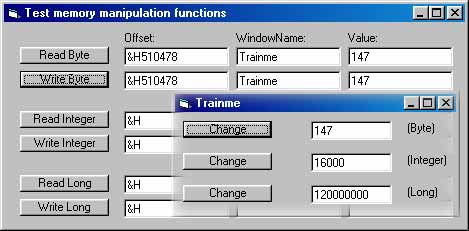



## Memory Read\\Write Functions

### Description

This is a module that contain functions to easily read\write Byte, Integer and Long datatypes (which is the three most common datatypes you would need in a basic trainer) to a process' memory and you are free to use the module in your own programs\trainers or just use it for educational purpose if you like.

In the same project file as the module, there is a little memory manipulation program I wrote that shows how to use each of the read\write functions, and to make the test-suite complete, I wrote a small program you can test the functions on by manipulating Byte, Integer and Long variables.

You can find the memory offsets for each variable in a text file named Offsets.txt, though the program was also designed so you can try to find the offsets by using a memory search tool such as GameHack or TSearch.

The whole project is widely commented and I suggest you read through it for a better understanding of what's going on.
 
### More Info
 
I don't really know much about compatibility in other Windows versions than Win98SE so a feedback on that would come in handy.

             |
---                |---
**Submitted On**   |2003-05-14 20:56:08
**By**             |[Cola\-Kattn](https://github.com/Planet-Source-Code/PSCIndex/blob/master/ByAuthor/cola-kattn.md)
**Level**          |Intermediate
**User Rating**    |5.0 (20 globes from 4 users)
**Compatibility**  |VB 6\.0
**Category**       |[Miscellaneous](https://github.com/Planet-Source-Code/PSCIndex/blob/master/ByCategory/miscellaneous__1-1.md)
**World**          |[Visual Basic](https://github.com/Planet-Source-Code/PSCIndex/blob/master/ByWorld/visual-basic.md)
**Archive File**   |[Memory\_Rea1593025272003\.zip](https://github.com/Planet-Source-Code/cola-kattn-memory-read-write-functions__1-45489/archive/master.zip)

